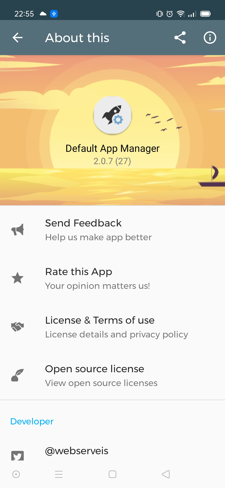

# Android About Screen 
 Plantilla para crear sección Todo sobre la app




### Instalación

Copiar la carpeta aboutscreen en la ralz del proyecto

En archivo añadir el modulo settings.gradle
```include ':aboutscreen'``

En gradle a nivel de aplicación añadir
```
dependencies {
    ...
    implementation project(path: ':aboutscreen')
    ...
```


###Configuración

Dentro del modulo en `values/string.xml` añadir los siguiente, pero remplaza los valores

 - %nombre@email.com Email feedbak 
 - %privacyurl Enlace de licencia de uso
 - %twitter_user_name Nombre de usuario en twitter
 - %twitter_link Enlace twitter, `https://twitter/<user_name`
 - %dev_email Email de desarrollador
 - %dev_email_link Enlace de email del desarrollador empezando con mailto:
 - %more_apps enlace para mostrar más aplicaciones, `https://play.google.com/store/search?q=pub%3ANombre_desarrollador&amp;c=apps`
 - %dev_profile Enlace del perfil de desarrollador en Google play, el identificador se obtiene dentro de la consola google play en sección desarrollador, ` https://play.google.com/store/apps/dev?id=<TU_ID_DEVELOPER>`
 - %dev_webpage Enlace de página web del desarrollador
 - %copyright texto para mostrar al pie de página, añade el %d que será sustituido por el año actual, `Copyright developer %d`
 

```
<string name="about_email_feedback" translatable="false">%nombre@email.com</string>
<string name="about_privacy_link" translatable="false">%privacyurl</string>
<string name="about_twitter_username" translatable="false">%twitter_user_name</string>
<string name="about_twitter_link" translatable="false">%twitter_link</string>
<string name="about_dev_email" translatable="false"%dev_email</string>
<string name="about_dev_email_link" translatable="false">%dev_email_link</string>
<string name="about_more_apps_link" translatable="false">%more_apps</string>
<string name="about_dev_google_play_profile_link" translatable="false">%dev_profile</string>
<string name="about_developer_web_page_link" translatable="false">%dev_webpage</string>
<string name="about_copyright" translatable="false">%copyright</string>
```

Para mostrar el icono de la aplicación en el directorio drawable sustiuir el `ic_launcher_round.png`


###Su implementación
Ahora solamente queda invocar la ventana About this, des de la app, en el archivo `xml/header_preferences.xml` añadir el fragmento del modulo

```
<PreferenceScreen xmlns:app="http://schemas.android.com/apk/res-auto">
    ...
    <Preference
        app:fragment="com.webserveis.app.aboutscreen.AboutPreferenceFragment"
        app:icon="@drawable/ic_info_outline_24dp"
        app:key="about_header"
        app:title="@string/pref_about_header" />
```


